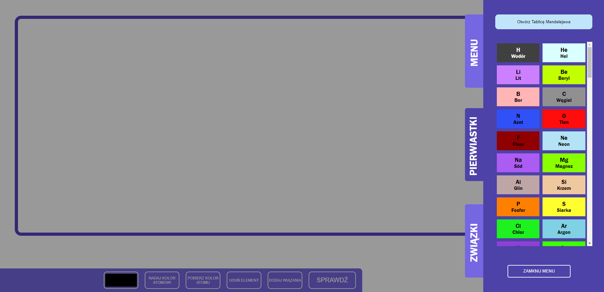

<!-- markdownlint-disable -->
# ALCHEMIK

<div id="top"></div>
<!-- PROJECT PAGE -->
<br />
<div align="center">
<h3 align="center">PROJEKT ALCHEMIK - INŻYNIERIA OPROGRAMOWANIA</h3>
  <p align="center">
    PAWEŁ HABRZYK, MATEUSZ KOWALSKI, MAREK JONCZYK, JAKUB FIGLER
  </p>
</div>

<!-- TABLE OF CONTENTS -->
<details>
  <summary>Spis Treści</summary>
  <ol>
    <li>
      Projekt
      <ul>
        <li>Opis projektu</li>
        <li>Narzędzia</li>
      </ul>
    </li>
    <li>Działanie aplikacji</li>
    <li>Kod</li>
    <li>Licencja Autorów</a></li>
    <li>Kontakt</li>
  </ol>
</details>
<br>


<!-- ABOUT THE PROJECT -->
## Projekt

Projekt ALCHEMIK został stworzony na potrzeby przedmiotu Inżynieria Oprogramowania, sem V, Wydział Mateamtyki Stosowanej Politechniki Śląskiej.

Celem projektu jest stworzenie narzędzia, które sprawi, że nauka chemii będzie bardziej atrakcyjna dla uczniów szkół średnich. Nauka chemii i matura z chemii są wyjątkowo specyficzne i stawiają unikalne wyzwanie przed abiturientami. Z tego też względu, głównym zadaniem grypy było stworzenie aplikacji służącej do pomocy nauczycielom oraz uczniom w nauce chemii w bardzo wizualny i przystepny sposób.

### Narzędzia

* [JavaScript](https://github.com/documentationjs/documentation)
* [HTML](https://www.w3schools.com/TAGS/default.ASP)
* [CSS](https://www.w3schools.com/css/default.asp)
* [JQuery](https://jquery.com)

<p align="right"><a href="#top">POWRÓT</a></p>

<!-- GETTING STARTED -->
## Działanie aplikacji

Aplikacja w bardzo prosty i intuicyjny sposób daje możliwość tworzenia, sprawdza oraz dodawania wiązań chemicznych. Główne miejsa obsługi aplikacji to: 
* PASEK NARZĘDZI<br>
  
<br>
* MENU BOCZNE<br>
  <br>
  <br>
  <br>

Dzięki prostej obsłudze, można w relatywnie szybki czasie osiągnąć zamierzone cele, jakimi moga byc m. in.:
* sprawdzanie poprawności wiązań
* tworzenie związków chemicznych
* łączenie pierwiastków

<p align="right"><a href="#top">POWRÓT</a></p>

<!-- USAGE EXAMPLES -->

<!-- CODE -->
## Kod

Tabela zawierająca wszystkie pierwiastki chemiczne
```
const periodicTable = [
    {"atomicNumber":1,"symbol":"H","name":"Wodór","atomicMass":"1.00794(4)","hexColor":"#404040","valences":[1],"placement":[1, 1]},
    {"atomicNumber":2,"symbol":"He","name":"Hel","atomicMass":"4.002602(2)","hexColor":"#D9FFFF","valences":[0],"placement":[1, 18]}...]
```

Klasa opisujaca Atomu
```
class Atom {
    constructor(Name, Color, Valence = 0, X = 5, Y = 5) {}
    newConnection(conn) {}
    removeConnection(conn){}
    generate(){}
    check(){}
}
```

Klasa odpowiadająca za tworzenie wiązań miedzy atomami
```
class Connection {
    constructor(Parent1, Parent2, Count = 1) {}
    generate() {}
    delete() {}
    changeCount(value) {}
}
```

Import wiązań do PDF
```
function CreatePDFfromHTML() {}
```

Import wiązań do IMG
```
function generateCanvas(){}

function getImage(type){
    var canvas = generateCanvas();
    var link = document.createElement("a");
    link.download = "structure."+type;
    link.href = canvas.toDataURL();
    link.click();
}
```

<p align="right"><a href="#top">POWRÓT</a></p>

<!-- LICENSE -->
## Licencja oprogramowania
Licencja MIT (Licencja X11) –  Daje użytkownikom nieograniczone prawo do używania, kopiowania, modyfikowania i rozpowszechniania (w tym sprzedaży) oryginalnego lub zmodyfikowanego programu w postaci binarnej lub źródłowej.<br><br> Jedynym wymaganiem jest, by we wszystkich wersjach zachowano warunki licencyjne i informacje o autorach.
<p align="right"><a href="#top">POWRÓT</a></p>

<!-- CONTACT -->
## Kontakt
Kontakt z autorami projektu dostępny jest za pomocą wiadomości mailowych dla podanych adresów: <br><br>
Jakub Figler - jakufig344@student.polsl.pl <br>
Paweł Habrzyk<br>
Mateusz Kowalski<br>
Marek Jonczyk<br>

<p align="right"><a href="#top">POWRÓT</a></p>